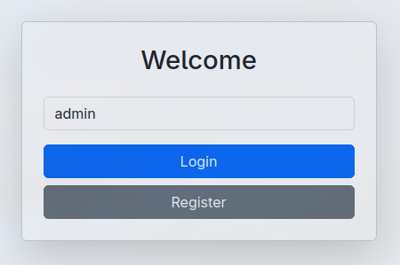
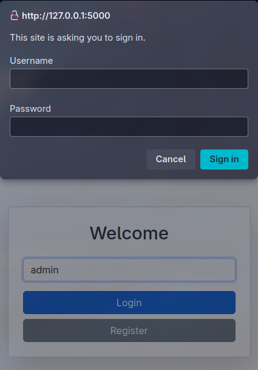
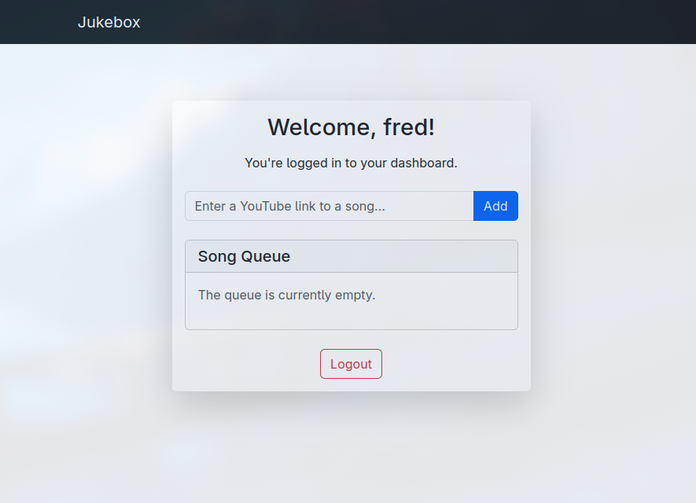

# 🎵 Jukebox

A joint music queue built with Flask. Jukebox allows users to add songs to a queue via YouTube and YouTube Music links, and an admin can control playback (pause, skip, clear queue) through a secure dashboard. Ideal for parties or shared spaces where everyone can contribute to the vibe.

---
- [Installation](#installation)
- [Using Jukebox](#using-jukebox)
---

I followed a lot of different tutorials and esentially Frankenstein's Monstered this together. Here is a list of the tutorials that I followed to get this working. 

### Official Flask documentation
- Great resource for getting started, [Flask Documentation](https://flask.palletsprojects.com/en/stable/).

### Downloading Music from YouTube with Python:
- [Tutorial](https://www.youtube.com/watch?v=U5CUkxUh2CQ) for a Discord Music bot which used yt-dlp and FFmpeg. 

### Simple Flask Blog from Scratch:
- Digital Ocean's tutorial for a [flask-blog](https://www.digitalocean.com/community/tutorials/how-to-make-a-web-application-using-flask-in-python-3). I used this to get a sense for the structure of a flask application. 

### User Authentication:
- Another Digital Ocean tutorial for [user-authentiacation](https://www.digitalocean.com/community/tutorials/how-to-add-authentication-to-your-app-with-flask-login)
- Also heavily used this [tutorial](https://youtu.be/Fr2MxT9M0V4?si=UXkqOSAb8cqTn49T)for user authentiacation. I ended up scrapping the passwords because they didn't seem to be necessary with the tests that I did.

### Admin Dashboard:
- Video showcasing default [admin-dashboard](https://www.youtube.com/watch?v=G1FBSYJ45Ww).
- Official [documentation](https://flask-admin.readthedocs.io/en/stable/). I had the defualt dashboard working originally but something broke when I was adding the Pause, Skip and Clear Queue buttons, and I couldn't figure out how to fix it :(

### Playing the Audio:
- Ended up using pygame for playing the audio using [this](https://youtu.be/5F9cl4ZCqQ8?si=VNEBMN1oKNDfPBVo) tutorial, which worked great. 

---

##  Features
-  Add songs to a shared queue by pasting YouTube or YouTube Music links
-  Admin dashboard for playback controls (Pause, Skip, Clear Queue)
-  Real-time updates using WebSockets (Flask-SocketIO)
-  BasicAuth-protected admin interface
-  Loading states to prevent duplicate submissions
-  Mobile-friendly interface

---

## Installation 

###  Prerequisites

- Python 3.8+
- FFmpeg 
- Git

## Windows
You can install all of the prerequisites using Choclatey, to install Chocolatey follow this [tutorial](https://youtu.be/-5WLKu_J_AE?si=0TgG6fzj7YFdLzOF).

Make sure you're running PowerShell as an administrator and install the packages 
```powershell
choco install python ffmpeg git.install
```
Once the packages are installed you can open a regular PowerShell instance and go to wherever you want the program to stay (i.e. C:\Users\<USERNAME>\Desktop\..) and clone it out.

```powershell 
# Clone the repo 
git clone https://github.com/FredDude2004/Jukebox.git
cd Jukebox

# Create and activate a virtual environment 
python -m venv venv
venv\Scripts\activate

# Install dependencies
pip install -r .\requirements.txt
```

Next you need to setup a .env file to store the passwords and database key, originally I just hardcoded the values and GitHub yelled at me so I had to use the dotenv library to store them securely

```powershell
# Create environment file
echo . > .env

# Open the file in your text editor of choice 
code . # opens current folder in VSCode
```

Then set the variables

```txt
# Database Key
SECRET_KEY=super_secret_key

# Username for admin dashboard must be 'admin' but password can be anything you want
BASIC_AUTH_USERNAME='admin' # keep this as admin
BASIC_AUTH_PASSWORD='password' # change this to whatever you want 
```

For setting a secure database key you can generate one like this,

```powershell
python -c "import secrets; print(secrets.token_hex(32))"
```

Then just set the SECRET_KEY variable to the output.

Now with everything set up you can just run the program. You will need to know your IP address so other users on your network can access the site. Once the server is running they can visit,

```txt
http://<YOUR_IP_ADDRESS>:5000
```
Run this command to get your IP Address.

```powershell
# get IP Address
Get-NetIPAddress | Where-Object {$_.IPAddress -like "192.168.*"} | Select-Object IPAddress
```

Then just run the program,

```powershell
python .\run.py
```

When you are done with the program, just send a KeyBoardInterrupt with ^C

## Linux
You can install all of the prerequisites using your distibustions package manager

```bash
sudo apt install python ffmpeg git 
```

Once installed you can navigate to wherever you want the repo to live

```bash
# Clone the repo
git clone https://github.com/FredDude2004/Jukebox.git
cd Jukebox

# Create a virtual environment
python -m venv venv
source venv/bin/activate  

# Install dependencies
pip install -r requirements.txt
```

Next you need to set up your environment variables 

```bash
touch .env

# Open the file in a text editor
vim .env
```

Then setup the variables

```txt
# Database Key
SECRET_KEY=super_secret_key

# Username for admin dashboard must be 'admin' but password can be anything you want
BASIC_AUTH_USERNAME='admin' # keep this as admin
BASIC_AUTH_PASSWORD='password' # change this to whatever you want 
```

For setting a secure database key you can generate one like this,

```bash
python -c "import secrets; print(secrets.token_hex(32))"
```
and just assign the SECRET_KEY variable to the output.

You are going to need your IP address for people on your network to be able to access the site.

```bash
# For Raspberry Pi
hostname -I

# For other distros
ip -4 -o addr show scope global | awk '{print $4}' | cut -d/ -f1 | grep '^192\.168\.'
```

Then you can run the program

```bash
python run.py
```

When you are done with the program, just send a KeyBoardInterrupt with ^C

## Using Jukebox
After following the [Installation](#installation) instructions on whatever device that you want to host the server you can start using the Jukebox.

### Admin Dashboard 
The first thing you should do after running the server for the first time is register the admin user. Visit the site by clicking on the link that is printed on the terminal and enter "admin" as the username and click register. 



To enter the Admin Dashboard you simply need to login as "admin".
You should then be prompted to enter the admin username and password that you set in the .env file



The Username should be "admin" and the password is whatever you set it to.

## User Dashboard
Once you are running the server and you have noted down your IP Address, others can visit the site by entering the link 

```txt
http://<YOUR_IP_ADDRESS>:5000
```

Once they are there they can enter their username, register and login. Once logged in they will be brought to the dashboard where they can view the queue and enter songs to be added to the queue. 



### NOTE:
There is a duration limit of the video link that can be submited of 1 hour and 10 minutes. This stops users from flooding the queue with "10 Hours of Fart Noises" while still allowing you to add longer mixes if so desired. 

